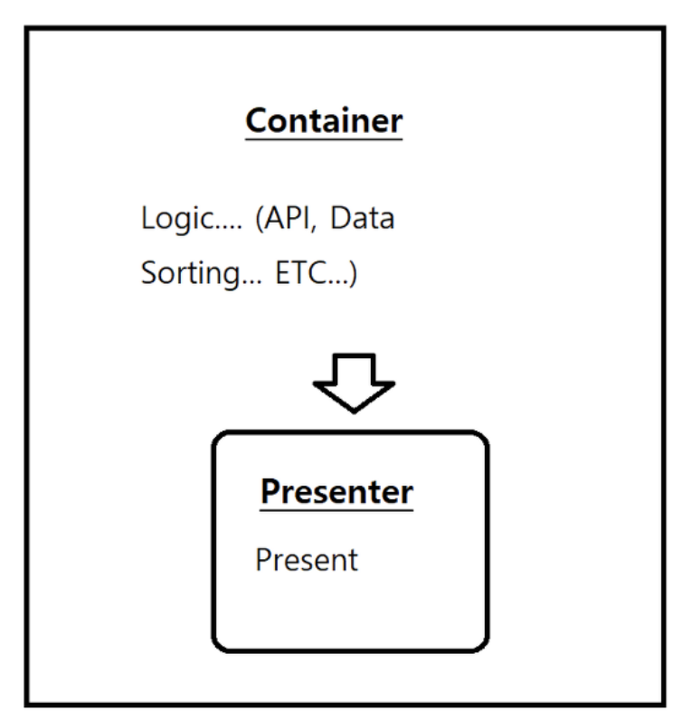

## 📂&nbsp; 프로젝트 이름 (Project Name)

### Book Flex

Application Logo

본 어플리케이션의 데이터는 Interpark book Open API를 기반으로 개발하였습니다. 
(An application used to filter data form Interpark book open API, built with React, JavaScript, and CSS.) 
 
Interpark book Open API : [http://book.interpark.com/bookPark/html/bookpinion/api_main.html]
 
 

 

## 👨‍💻&nbsp;사용된 기술스택 (Used Tech Stack)

#### Front-End : HTML5, CSS, JavaScript

#### Back-End : -

#### Database : -

#### UI Framework and Libraries: ReactJS

#### Design pattern : Container and Presenter Pattern

<table>
    <tr>
        <td>
            
        </td>
        <td>
            <h2><b>A container</b></h2>
            
- child-components에 데이터를 제공해주는 역할을 한다.

            
- DOM Markup에 대한 작성은 없다.

            

            

            <h2><b>A presenter</b></h2>
            
- 주로 보여지는 것과 관련된 처리를 한다.

            
- 항상 DOM markup과 styles에 대한 작성을 한다.

            
- 어떻게 data가 load, transformed, or mutated는지에 대한 처리는 하지 않는다.(Container 영역)

        </td>
    </tr>
</table>

 

 

## 🖼️&nbsp; 프로젝트 와이어프레임 (Project Wireframe)

<table>
    <tr>
        <td>
            
        </td>
        <td>
            
        </td>
    </tr>
    <tr>
        <td style="text-align:center">Main page</td>
        <td style="text-align:center">Detail page</td>
    </tr>
</table>
 

 

## 🧑🏼‍💻&nbsp;프로젝트의 요구사항 및 특징 (Project Requirements and Features)

- 판매되고 있는 책의 정보를 사용자에게 제공한다.
- IT 관련 서적은 별도의 메뉴에서 관리를 한다.
- 베스트셀러, 추천도서, 새로 출간된 도서를 카테고리별로 분류해서 화면에 출력한다.
 
 

 

## Project Status

#### 🗓️ &nbsp; 2020.11.18

프로젝트는 현재 개발중인 상태이며, 사용자들은 판매중인 책의 정보를 얻을 수 있다. 네비게이션 메뉴는 세 개의 메뉴로 구성이 되어있으며, 일반 도서, IT관련 도서 그리고 검색 메뉴로 구성이 되어있다.  
(This project is currently in development. Users can get the information of the book on sale. Navigation menu is consist of three menu. One is general books information and the other is classified as an IT-related books, and another is search menu.)

#### 🗓️ &nbsp; 2020.11.23

프로젝트 개발 완료

## 프로젝트 스크린샷 (Project Screen Shot(s))

#### Example:

[ PRETEND SCREEN SHOT IS HERE ]

[ PRETEND OTHER SCREEN SHOT IS HERE ]

## 프로젝트 설치 및 설정 지침 (Installation and Setup Instructions)

① Clone down this repository. You will need `node` and `npm` installed globally on your machine.

② Installation:

`npm install`

③ To Start Server:

`npm start`

To Visit App:

Book Flex : [https://localhost:3000/]

## 🤔&nbsp;프로젝트를 마치며 (Project Reflection)

❓Q1.&nbsp;이 프로젝트의 배경은 무엇인가?  
→ 사이드 프로젝트(Side project)로 ES6이후의 JavaScript와 Component기반의 React를 사용한 개발에 좀 더 익숙해지기 위해 개인적으로 진행한 프로젝트 입니다. Container-Presenter Pattern으로 프로젝트를 구성하는 연습을 해보았다.

❓Q2.&nbsp;무엇을 만들기 위한 목적으로 개발되었나?  
→ 책을 구매하는 사용자를 위해 베스트셀러, 추천도서, 신간도서로 카테고리를 분류하여, 일반도서와 소설, IT관련 서적에 대한 정보를 제공하기 위해 개발을 하였다.

❓Q3.&nbsp;이 프로젝트를 통해서 얻고자 하는 것과 개발경험에 있어, 어떤 부분이 도움이 되었는가?
→ 우선 Component기반의 라이브러리를 사용해서 개발하는 좋은 경험이 되었던 것 같습니다. 화면의 구성을 Component 단위로 쪼개서 화면을 구성하고, 각 Component가 재사용성이 가능해지면서 좀 더 효율적인 개발이 가능했던 것 같습니다. 또한 ES6 이후에 업데이트된 JavaScript의 문법적인 사용에 있어, 좀 더 익숙해질 수 있었던 좋은 기회였던 것 같습니다.

❓Q4.&nbsp;프로젝트 진행중에 예상치 못했던 어려움이 있었나?  
→ 특별한 어려움은 없었습니다.

❓Q5.&nbsp;이 프로젝트를 구현함에 있어 사용했던 도구/라이브러리는 무엇입니까?  
→ 이 프로젝트를 구현함에 있어 사용했던 것은 React framework입니다.

❓Q5.&nbsp;이 프로젝트를 구현함에 있어 사용했던 도구/라이브러리는 무엇입니까?  
→ Vanilla JS대신에 React JS를 사용한 이유는 웹앱이 점점 더 복잡해지고 역동적이게 변하고 있기 때문에 프로세스의 속도를 높이기 위해서 React와 같은 새로운 라이브러리를 사용해서 개발하는 것에 익숙해져야 한다고 생각했기 때문입니다. 
Front-End 라이브러리가 등장하게 된 배경은 동적인 웹 페이지를 보다 효율적으로 유지보수하고 관리하기 위함인데, 요즘 웹은 단순히 정보전달하는 페이지가 아닌, User의 Interaction을 처리하기 위한 상태 변화가 상당히 많은 부분에서 이뤄지기 때문에 좀 더 자연스러운 유저 인터페이스로 만들어 주기 위해 이러한 Front-End 라이브러리/프레임워크가 등장하게 되었다. 따라서 이러한 웹 애플리케이션을 좀 더 dynamic하게 표현하며 개발을 하기 위해 ReactJS를 선택하였습니다.   \*프로세스의 속도를 높이기 위해서 
→ React는 데이터가 변경됨에 따라 적절한 Component만 효율적으로 갱신하고 Rendering하기 때문이다.
